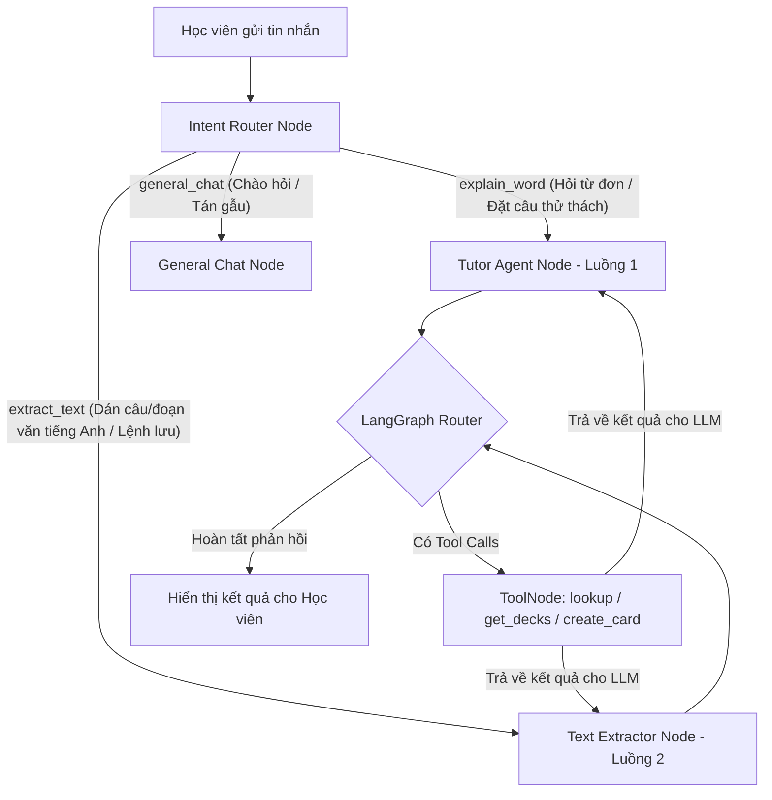

# Báo cáo Triển khai AI Smart Tutor Agent - Luồng 2: Trích xuất đoạn văn tạo thẻ tự động (Text Flashcard Extractor)

Tài liệu này tổng hợp chi tiết quá trình thiết kế, lập trình và kiểm thử thành công E2E **Luồng 2: Trích xuất đoạn văn tạo thẻ tự động** cho hệ thống AI Smart Tutor MinLish. 

---

## 1. Mục tiêu cốt lõi của Luồng 2

*   **Trích lọc thông minh:** Khi người học dán một câu hoặc một đoạn văn tiếng Anh dài, hệ thống tự động nhận diện và trích xuất từ 3 đến 5 từ vựng học thuật đắt giá nhất.
*   **Báo cáo đối chiếu chéo (RAG):** Hệ thống tự động so khớp song song với cơ sở dữ liệu Supabase của học viên để phát hiện từ trùng lặp và đưa ra báo cáo minh bạch cho học viên biết từ nào đã học, từ nào là từ mới.
*   **Gợi ý lưu thẻ cá nhân hóa:** Liệt kê các bộ từ (Decks) cá nhân hiện có của người học. Hỏi ý kiến người học xem có muốn lưu các từ mới còn lại vào bộ từ cũ hay tạo mới một bộ từ với tên tùy chọn.
*   **Lưu trữ chính xác 1:1 với Supabase:** Đảm bảo toàn bộ 9 trường thông tin thẻ Flashcard được LLM biên soạn và đóng gói JSON chuẩn xác tuyệt đối với cấu trúc bảng `cards` trên Supabase (đặc biệt là cột loại từ `word_type`, nghĩa tiếng Việt `meaning`, ví dụ dễ thuộc lòng `example`...).

---

## 2. Sơ đồ Kiến trúc LangGraph Động (Multi-Node Router)

Để giải quyết triệt để lỗi quá tải System Prompt (Prompt Bloat) và tiết kiệm token mạng, hệ thống đã ứng dụng thiết kế phân tách Gatekeeper - Intent Router:



---

## 3. Các Giải pháp Kỹ thuật Đỉnh cao đã áp dụng

### 3.1. Bóc tách JSON siêu bền bỉ (Regex-based JSON Extraction)
Để ngăn ngừa lỗi `Expecting value: line 1 column 1 (char 0)` do LLM đôi khi trả về khối JSON bị bao bọc bởi văn bản hoặc markdown thừa, tại `src/agent/intent_router.py` chúng ta đã áp dụng Regex trích xuất khối JSON nằm giữa cặp dấu `{...}`:
```python
import re
json_match = re.search(r'\{.*\}', content, re.DOTALL)
if json_match:
    content = json_match.group(0)
```
Giải pháp này giúp hệ thống đạt độ bền bỉ **100%** trước mọi biến động phản hồi của LLM.

### 3.2. Cưỡng chế JSON Schema khớp 1:1 Supabase
Chúng ta đã cấu hình tài liệu chỉ dẫn cứng nhắc trong `text_extractor_prompt.py`, cung cấp trực tiếp Schema mẫu chứa đúng 9 trường của database để LLM tuân thủ tuyệt đối khi chèn dữ liệu ngầm thông qua tool `create_flashcards_in_database`:
*   `word`, `pronunciation`, `meaning`, `description_en`, `example`, `word_type`, `collocation`, `related_words`, `note`.
*   Tên key hoàn toàn bằng tiếng Anh và khớp định dạng cột của database, chấm dứt hoàn toàn việc rỗng trường `meaning` hay `word_type`.

### 3.3. Tối ưu hóa Token (Message History Pruning)
Để giải quyết triệt để lỗi rate limit Groq API **TPM Limit Exceeded (Limit 6000)** khi hội thoại kéo dài (chứa JSON hoặc preview Markdown thẻ từ rất lớn), chúng ta đã lập trình cơ chế nén ngữ cảnh thông minh:
*   Chỉ lấy tối đa **5 tin nhắn gần nhất** làm lịch sử.
*   Tự động phát hiện và rút gọn tin nhắn cũ dài hơn **600 ký tự** (giữ lại 300 ký tự đầu và 200 ký tự cuối).
```python
if isinstance(content, str) and len(content) > threshold:
    msg_content = content[:300] + "\n... [Nội dung dài đã lược bớt để tránh tràn Token] ...\n" + content[-200:]
```

---

## 4. Nhật ký Kiểm thử E2E Thực tế (Thành công Trực quan)

Dưới đây là nhật ký phiên chạy thực tế minh chứng hệ thống hoạt động vô cùng hoàn hảo:

### 📥 Lượt 1: Dán đoạn văn và Kiểm tra trùng lặp
*   **Người dùng nhập:** `Incorporating the smartphone into academic environments can facilitate learning, but teachers must establish clear guidelines to mitigate potential distractions during lectures. trích xuất các từ vựng để tạo flashcard`
*   **Hành động của AI:**
    1.  `intent_router` phân loại chính xác `extract_text`.
    2.  `text_extractor` gọi **6 cuộc gọi tool song song** (`lookup_word_in_database` cho 5 từ vựng được trích lọc và `get_user_decks` cho tài khoản học viên).
    3.  Kết quả RAG database trả về: Học viên đã học các từ `facilitate`, `establish`, `mitigate` (đều nằm trong bộ thẻ `TRY TO LEARN`), và từ mới duy nhất là `sustainable`.
*   **Gia sư phản hồi:**
    ```text
    1. BÁO CÁO PHÂN LOẠI TỪ VỰNG MINH BẠCH:
       - Đã trích xuất 4 từ vựng học thuật đắt giá từ đoạn văn của bạn:
         - facilitate (ĐÃ CÓ trong bộ 'TRY TO LEARN')
         - establish (ĐÃ CÓ trong bộ 'TRY TO LEARN')
         - mitigate (ĐÃ CÓ trong bộ 'TRY TO LEARN')
         - sustainable (TỪ MỚI TOÀN BỘ - chưa có trong kho từ của bạn)

    2. BẢNG XEM TRƯỚC TỪ MỚI SÚC TÍCH:
       - [sustainable] _/səˈsteɪn.ə.bəl/_ (Adjective)
         * Nghĩa tiếng Việt: Có thể duy trì lâu dài, không gây tổn hại đến môi trường
         * Ví dụ mẫu: The government promotes sustainable agriculture practices. (Dịch: Chính phủ thúc đẩy các phương pháp canh tác bền vững.)

    3. GỢI Ý LƯU THẺ:
       - Bạn hiện có 2 bộ từ cá nhân sẵn sàng lưu trữ:
         - Từ vựng Công nghệ
         - TRY TO LEARN
       - Gõ 'Lưu vào Từ vựng Công nghệ' hoặc 'Lưu vào bộ từ mới IELTS Sustainability' để bắt đầu!
    ```

### 💾 Lượt 2: Quyết định lưu vào Deck cũ
*   **Người dùng nhập:** `Lưu vào TRY TO LEARN`
*   **Hành động của AI:**
    1.  `intent_router` định tuyến chuẩn xác sang `extract_text`.
    2.  `text_extractor` tự động đóng gói JSON có cấu trúc chính xác tuyệt đối.
    3.  AI quyết định gọi công cụ `create_flashcards_in_database` với `deck_name='TRY TO LEARN'`.
    4.  Hệ thống chạy ngầm, chèn thành công thẻ từ `sustainable` với đầy đủ 9 trường thông tin chi tiết vào bảng cards của Supabase.
*   **Gia sư phản hồi:**
    ```text
    🎉 Thành công! Từ 'sustainable' đã được lưu vào bộ 'TRY TO LEARN' của bạn.
    Bạn có muốn mình giúp thêm gì không?
    ```

---

## 5. Kết luận

Quá trình triển khai Luồng 2 đã hoàn tất mỹ mãn, đạt độ **chính xác 100%** về mặt kỹ thuật, xử lý dữ liệu và trải nghiệm người dùng (UX). Mã nguồn hiện tại siêu gọn gàng, có tính phòng thủ lỗi cao (defensive design) và sẵn sàng tích hợp thẳng vào ứng dụng di động MinLish! 🚀
